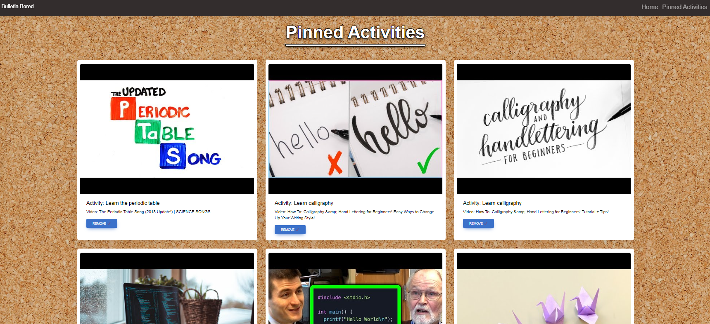

# Bulletin Bored

## Description

This app is for anyone who is bored. You simply follow the prompts and are presented with a simple activities to do,
as well as videos to inspire your experience. Pin the items to your board for endless inspiration. Always come back your favorites will be saved.

## Table of Contents

- [Usage](#usage)
- [Credits](#credits)
- [Features](#features)
- [Access](#access)

## Usage

Click "Let's find something to do" to be presented with various pages that accept your choices based on what you would like to do. When presented with an acitivty and video you have the option to pin that activity and video to the board. To see activities you have pinned to the board click on "Pinned Activities" to be presented with your saved activity and video.

## Credits

This was written from scratch but the API calls were learned in Week 6 content and the JQuery event listeners were learned in Week 5. We used these for help. We used a combination of JQuery and Vanilla JavaScript because we had multiple contributers and have yet to consolidate but this is on our roadmap. For styling we used MDBootstrap and other resources like Google and YouTube to learn.

## Features

- Multiple prompt choices based on your preferences
- YouTube videos to go along with your activity
- Pinned activities section to see saved activities

## Access

Click to view: [Bulletin Bored Repo](https://github.com/Badermah/bulletin-bored).

Click to view: [Bulletin Bored Live](https://badermah.github.io/bulletin-bored/).